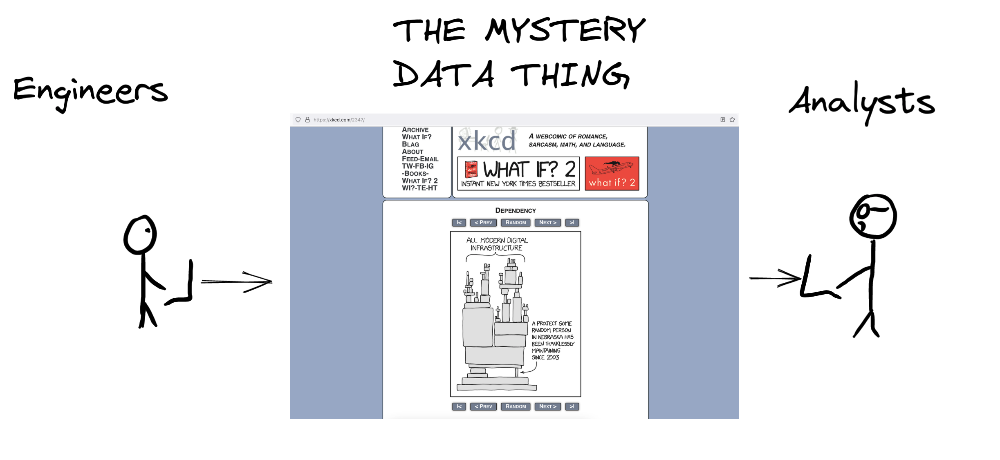
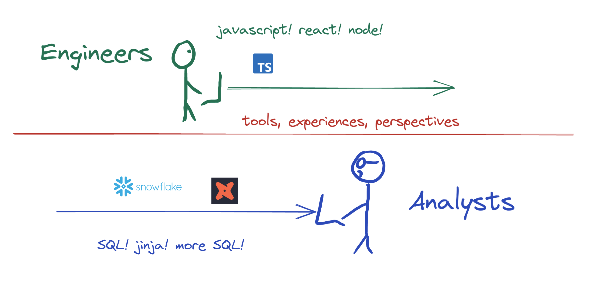
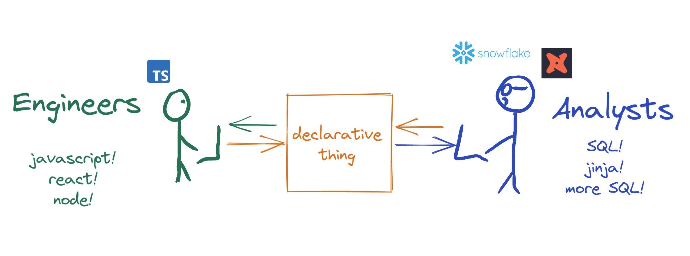

Between [6 River Systems](https://6river.com/?utm_source=buz.dev&utm_content=hiitsme) and [CarGurus](https://www.cargurus.com/), a very significant amount of my time over the past five years has been dedicated to data platform automation, reducing cross-team friction, and improving data quality.

Schemas (or as they seem to be called now, "data contracts") have played a critical role in all of the above. But before diving straight<!--truncate--> into the role of schemas (er... contracts) let's talk data platforms.

## Components of a Good Data Platform

### Instrumentation and Integration

This one pretty much goes without saying. If data is not being emitted from source systems, you won't have any data to play with.

And if you don't have any data to play with, you won't be able to complain about the price of Snowflake and might feel left out.

Instrumentation is pretty important. It's also a pretty huge PITA to wrangle, which is why [tracking](https://segment.com/academy/collecting-data/how-to-create-a-tracking-plan/) [plans](https://amplitude.com/blog/create-tracking-plan) [became](https://www.avo.app/blog/what-is-a-tracking-plan-and-why-do-you-need-one) [a](https://www.indicative.com/resource/data-tracking-plan/) [thing](https://www.trackingplan.com/).

### The pipeline

Pipelines are either `batch` or `streaming`. There's a holy war going on between the two religions but similar concepts apply to both.

Pipelines collect data and put it somewhere. That's really it.

The _best_ pipelines:

- Collect data reliably.
- Annotate payloads with metadata such as provenance, `collected_at` timestamps, etc.
- Generate stats to provide the operator with feedback.
- Validate and bifurcate payloads, if you're lucky.
- Know about and act on payload sensitivities - obfuscate, hash, tokenize, redact, redirect, etc.
- Minimize moving pieces.
- Don't spend all the CEO's 💸💸💸 so they can afford that house in the Bahamas.

### Storage and access

Data has to be stored somewhere- preferably it's somewhere accessible.

Storage/access systems range from a wee little Postgres database, to Snowflake, to a data lake filled with Parquet fish and the ~~Loch Ness~~ Trino monster strapped onto it.

### Data Discovery

As things scale, pipelines/databases/data models typically turn into something even the James Webb can't stitch back together.

Data discoverability is super important when organizations are fragmented, or when you're new to the company, or when you forget stuff as I often do.

### Observability, Monitoring, and Alerting

Last, definitely not least, and scarily-rare... tools that tell the operator if things are broken.

These could be devops-y tools like Prometheus/Alertmanager/Grafana, pay-to-play tools like data quality/reliability platforms, or something dead-simple like load metadata tables and freshness checks.

## Design Goals of a Good Data Platform

### Comply with rules

While maybe not the case within the US (for us Non-Californians), data regulation and compliance is kind of a big deal. If you don't comply, you [might](https://www.wired.com/story/google-analytics-europe-austria-privacy-shield/) [get](https://techcrunch.com/2022/06/23/google-analytics-italy-eu-data-transfers/) the [boot](https://edpb.europa.eu/news/national-news/2022/italian-sa-bans-use-google-analytics-no-adequate-safeguards-data-transfers_en).

Compliance is becoming less of a `goal` and more of a `requirement`.

### Minimize bad data

Bad data is expensive. It's expensive to move, it's expensive to store, it's expensive to keep track of, and it's expensive to work around. Not knowing data is bad is even more expensive.

### Maximize knowledge of what the system is doing

Good things come from a knowledge of what a system is doing and when it is doing it.

Only after observation can you creatively optimize cost.

Only after timing can you make things faster.

And only after seeing a system end-to-end can you cut out unnecessary intermediaries.

### Minimize friction for all parties involved

Data platforms should be a good experience for anyone who is involved, which includes **many** more parties than just analytics engineers or analysts.

The parties who are critical to success include:

- The frontend engineers, who work with Javascript/Typescript and any number of frameworks 
- The backend engineers, who work with Python, Node, Java, Go, C++
- The native/app engineers, who work with something like Swift, Flutter, React Native
- The devops people, who like when they can write less Terraform
- The SRE people, who like when they can see what's going on without asking you. Because you'll probably be asleep when they try.
- The data engineers, who are usually on the hook when data goes bad.
- The analytics engineers, who like when `user_id` means `user_id`.
- The analysts, who like when they can push value back to product engineers.
- The financefolk, who will come after you when costs exponentially increase.
- The businessfolk, who will also come after you when costs exponentially increase.

While data mandates and a new breed of data-oriented law might sound lovely (or not), these mechanisms only benefit a couple of the above parties. Mandates don't work. Telling other people to have more responsibility, so you can have less, also doesn't work.

Want to get buy-in? Minimize friction. Want to increase adoption? Automate others' toil. Want sustainable systems? Reduce cognitive load.

Which brings us back to schematizing stuff.

## The Contract-Powered Platform

After spending too much time figuring it out I've come to realize schemas are the nucleus of efficient data platforms.

Schematizing data before it's generated is often seen as unnecessary overhead or a productivity drain. Admittedly, the idea is often discarded in favor of the wild west of arbitrary json. But let's ignore that for now and dig in for the sake of science.

### Schemas empower the "producer" <-> "consumer" relationship

Let's think about the two ends of data systems for a second.

Engineers live at the source, product analysts typically live at the "destination", and a black box lies between:

But when the mystery data thing is removed the `engineer` <-> `analyst` dynamic actually looks more like this:

This working dynamic is pretty terrible for productivity. The two parties communicate. Sometimes. There's a ton of friction but neither party is to blame. Data engineers and managers are asked to join the subsequent meetings, and implicit "contracts" are established in a Google doc that everyone will lose track of.

(Human-readable) schemas turn this dynamic into something that looks more like the following:

Both parties are able to contribute to the shared schema using the same "language", and the schema is then leveraged to generate the equivalent representation in their language of choice.

### Schemas are data discovery

In LinkedIn's [popular metadata architectures explained](https://engineering.linkedin.com/blog/2020/datahub-popular-metadata-architectures-explained), pull-based metadata extraction is outlined as "an ok start". Push-based metadata is "ideal".

Schematizing data upfront means data discovery and documentation writes itself.  Metadata is discoverable as soon as schemas are deployed, which is often before the data actually starts flowing.

Schematization mechanisms like JSON Schema also get [pretty meta](https://json-schema.org/specification.html#meta-schemas), so it's easy to add schema-level metadata:

- "These properties contain PII"
- "These properties should be tokenized"
- "This person on this team owns this schema"
- "This is version 1.2 of this schema"

This class of metadata is a CISO's _dream_.

### Schemas power data validation in transit

Comparing a payload to "what it was supposed to be" and annotating it with a simple 👍👎 is super useful. Schemas are the "what it was supposed to be".

### Schemas help stop bad instrumentation from being implemented

Another +1 (for engineers) is the fact schemas help bad tracking from getting deployed in the first place.

Typescript+VSCode complains during development if required props are missing, or if one is a `string` and should be a `bool`. And then code blows up at compile time if the bug is still there.

Nobody likes being the person who causes the release train to halt. Or being the person who caused the rollback because a prop was missing. **Especially when it's "just for analytics".**

### Schemas improve code quality
This might be a stretch. Or maybe not.

Have you tried forcing a typescript-oriented engineer to use `Any`, but also required them to have `propA`, `propB`, and `propC`. And `propC` must be a `bool`? Especially after they've added lint rules restricting the use of `Any`?

Or tried forcing a golang-oriented engineer to use a `map[string]interface{}`, but told them the payload must have specific keys?

Both are pretty silly.

Schemas are centralized verbiage from which to generate language-specific data structures. Tools like [Quicktype](https://github.com/quicktype/quicktype), [Typebox](https://github.com/sinclairzx81/typebox), and [jsonschema-to-typescript](https://www.npmjs.com/package/json-schema-to-typescript) make this a reality. The same can be said about [JTD](https://www.rfc-editor.org/rfc/rfc8927).

### Schemas power automation

Schemas make data engineering quality of life significantly better. Destination tables can be created and migrated as schemas evolve. Kafka topics and Pub/Sub streams can be automatically provisioned using the schema namespace. A single stream can be fanned out to a [dynamically-partitioned data lake](https://docs.aws.amazon.com/firehose/latest/dev/dynamic-partitioning.html). And a whole lot more.

### Schemas as observability

Once payloads have an associated schema or namespace, splicing stats into observability tools is the natural next step.

Stakeholder FAQ's (long before actual analytics) commonly look like:
- "I just implemeneted tracking. Is the data flowing?"
- "When was some.event.v1 first deployed?"
- "Is some.event.v1 still flowing?"
- "Are we seeing any bad events after most recent deploy?"
- "How much data are we processing for schema x.y.z?"
- "I just changed some javascript. Am I still emitting one event or has it become ten?"
- "What team should I go ask about a.b.c?"
- "How does this event get generated again?"

### Schemas power compliance-oriented requirements

Adhering to data privacy-oriented regulation requires a rethink of pretty much all data processing systems. The place to tokenize, redact, or hash personal information is not at the end of the data pipeline. It is at the start of the pipeline. Otherwise you'll have sensitive data lying all over S3 in cleartext, and no clue how to actually find or mitigate it.

### Schemas are the foundation of higher-order data models

It is pretty easy to turn a schema into a [dbt source](https://docs.getdbt.com/docs/building-a-dbt-project/using-sources), so analytics engineers can reliably build upon a well-defined, trustworthy foundation.

### Schemas are the foundation of data products

# A Contract-Powered Way of Working

