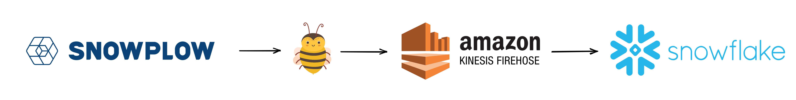

[Snowplow Analytics](https://snowplow.io/) is a highly-scalable system that empowers [structured data creation](https://snowplow.io/blog/why-data-contracts-are-obviously-a-good-idea/) for [millions of sites](https://trends.builtwith.com/analytics/Snowplow) on the internet. Snowplow tracking is incorporated into [dbt](https://github.com/dbt-labs/dbt-core/blob/main/core/dbt/tracking.py#L33-L47), [dbt cloud](https://cloud.getdbt.com/), [Trello](https://trello.com/), [Gitlab](https://gitlab.com/), [Citi bank](https://www.citi.com/), [Backcountry.com](https://www.backcountry.com/), and the list goes on.

After setting up data infrastructure [like Snowplow](https://bostata.com/268-billion-events-with-snowplow-snowflake-at-cargurus) for [years](https://bostata.com/client-side-instrumentation-for-under-one-dollar)  I've frequently found myself wishing for both **less** and **more**.

**Fewer streams**, **fewer machines or containers to manage**, **fewer moving pieces to help prevent event duplication or loss**, **less configuration**, and **less in-house documentation to keep things running** would be a dream.

**Deployment flexibility**, **flexible schema storage**, **cost efficiencies**, **seamless migration between transport systems**, **improved utility from the data in transit**, and **increased visibility** would also be very helpful.

Meanwhile, serverless technologies have come into their own and point the way toward a very bright data-processing future. Which is how **[buz.dev](https://buz.dev)** was born.

<!-- truncate -->

## Inspirations and iterations

My first iteration of "serverless Snowplow Analytics" was in 2018.  I stitched together a [Cloudfront distribution](https://docs.aws.amazon.com/AmazonCloudFront/latest/DeveloperGuide/distribution-working-with.html), a [Python-based Lambda function](https://docs.aws.amazon.com/lambda/latest/dg/lambda-python.html), S3, and the [Snowplow javascript tracker](https://www.jsdelivr.com/package/npm/@snowplow/javascript-tracker?path=dist) to stockpile event data. A series of [Athena external tables](https://docs.aws.amazon.com/athena/latest/ug/creating-tables.html) sat on top of the raw data and voila! Near-real-time analytics for practically free. It worked so well [a blog post was written](https://bostata.com/client-side-instrumentation-for-under-one-dollar/) and other people were inspired to [build](https://discourse.snowplow.io/t/snowplow-serverless/1912/14) or [write about](https://www.ownyourbusinessdata.net/enrich-snowplow-data-with-aws-lambda-function/) the same. The system ran hands-off with very little effort on my part, thanks to **minimal moving pieces** and **AWS having the responsibility of keeping it up and running**. 

Serverless event collection worked very well at scale during my time at [CarGurus](https://www.cargurus.com/). While we had a Snowplow Analytics implementation, a colleage wanted to see what AWS Lambda could handle. The marketing team sent enormous amounts of email using a combination of [Iterable](https://iterable.com/) and [Dyn](https://help.dyn.com/email-delivery-gsg/), and each blast would result in production systems being absolutely swamped with tracking callbacks. The analytics team wanted data for analytics or tracking opt-outs, but nobody wanted to provision (normally unused) static infrastructure. Lambda was a perfect fit. The system continuously ramped from 0 to ~20k rps and back again, the AWS bill was laughably small, and it required virtually zero maintenance.

After setting up Snowplow for a [NYC-based commercial real estate company](https://www.bisnow.com/), the VP of Technology (who is now @ Disney Streaming) pushed my implementation further with a simple Lambda function. Instead of being limited to Snowplow protocol payloads, the Lambda function collected arbitrary json payloads, reformatted them as Snowplow [Self-Describing Events](https://docs.snowplow.io/docs/understanding-tracking-design/out-of-the-box-vs-custom-events-and-entities/#self-describing-events), and fired them into the Snowplow collector. It was efficient and effectively hands-off. I have thought about his work ever since.

The rich benefits of serverless data processing for robotics and fulfillment were experienced while working at [6 River Systems](https://6river.com/data-driven-robotics-leveraging-google-cloud-platform-and-big-data-to-improve-robot-behaviors/) (Shopify Logistics). Data volumes from fulfillment systems are highly variable. One warehouse or distribution center will have a very different traffic pattern than another, but volume across all of them spikes to orders of magnitudes higher [during Peak months](https://supplychaingamechanger.com/strategies-to-survive-the-peak-season-fulfillment-surge/). Over-provisioned infrastructure in an industry where margins are already tight is a complete non-starter. Serverless was the only option and did not disappoint.

And finally, my time working alongside Okta's security team has thoroughly solidified the value of serverless technologies in a security-conscious setting. _Security teams absolutely love serverless tech._ Want proof? Go check out [Matano.dev](https://www.matano.dev/), ask [Panther](https://panther.com/) how their systems are built, or dig into [AWS marketing materials](https://aws.amazon.com/blogs/publicsector/how-public-sector-security-teams-can-use-serverless-technologies-improve-outcomes/).

**Serverless is the secret of highly efficient data processing. It is the way to make streaming accessible.**

# Why Build Buz?

While incredibly scalable and robust, setting up and maintaining OSS Snowplow is not for the faint of heart. It's time-consuming to set up, requires a deep understanding of the moving pieces to tune well, and requires significant engineering resources.

A very common Snowplow architecture diagram looks like the following, excluding monitoring, alerting, log centralization, and other devops necessities:

Opportunity costs matter to cost-conscious buinesses, and engineering resources dedicated to maintaining data pipelines are rarely the best use of said resources. ***Engineers also prefer to spend their time using streaming data rather than moving it around***.

So my initial goal was to build a system like the following:

Snowplow tracking SDK's would be used for instrumentation. The serverless collector thing called Buz would collect, validate, and route payloads to S3 via Kinesis Firehose. And Snowflake would provide the compute on top of S3.

## Buz Requirements and Design

### Minimal human involvement to keep running

Systems are great when you don't need to think about them. In [Julia Evans'](https://twitter.com/b0rk) words, spending **[approximately 0 time on operations](https://jvns.ca/blog/2022/07/09/monitoring-small-web-services/)** was the goal.

### Self-contained and capable of running horizontally with no issue

There's a movement of "small, mighty, and self-contained" afoot within data processing systems.

*It's because complexity is hard to keep running*.

Systems like [Redpanda](https://redpanda.com/), which crams the Kafka api into a small self-contained binary, or [Benthos](https://www.benthos.dev/), which crams cool stream-processing functionality into a small self-contained binary, are highly inspirational.

The Serverless Thing called Buz needed to do the same.

### No JVM, no Spark, no Beam

Snowplow's [collector](https://docs.snowplow.io/docs/pipeline-components-and-applications/stream-collector/), [enricher](https://docs.snowplow.io/docs/pipeline-components-and-applications/enrichment-components/enrich/#enrich-kinesis), [s3 sink](https://docs.snowplow.io/docs/pipeline-components-and-applications/loaders-storage-targets/s3-loader/), etc all run on the JVM.

Snowplow's [RDB](https://docs.snowplow.io/docs/pipeline-components-and-applications/loaders-storage-targets/snowplow-rdb-loader-3-0-0/) and [Snowflake](https://docs.snowplow.io/docs/pipeline-components-and-applications/loaders-storage-targets/snowplow-snowflake-loader/) loaders run on Spark while the [BigQuery](https://docs.snowplow.io/docs/pipeline-components-and-applications/loaders-storage-targets/bigquery-loader/) loader runs on Beam (Cloud Dataflow).

But... Snowflake's [Snowpipe](https://docs.snowflake.com/en/user-guide/data-load-snowpipe-intro.html) works well, as do BigQuery [streaming inserts](https://cloud.google.com/bigquery/docs/samples/bigquery-table-insert-rows) or  [Pub/Sub subscriptions](https://cloud.google.com/pubsub/docs/bigquery). And the responsibility of keeping Snowpipe or BQ streaming inserts running is offloaded :).

Serverless Thing was to shed as many dependencies as possible.

### Fast startup and shutdown

Making containers fast to launch makes a big impact on cost as invocations ramp, so Serverless Thing had to be snappy. The faster infrastructure can follow the utilization curve, the more cost-effective it is. In an environment where costs are being scrutinized, **doing work fast** is just as important as **not running at all when there is no work to be done**.

Being efficient also happens to be pretty damn good for the environment. Burning fewer polar bears seems to [resonate with others](https://medium.com/@intive/this-months-reason-technology-will-save-the-world-energy-savings-and-serverless-principles-375660c8ed81) like [DuckDB](https://youtu.be/Z-6SnP6yzgo?t=1826) and [451 Research](https://d39w7f4ix9f5s9.cloudfront.net/e3/79/42bf75c94c279c67d777f002051f/carbon-reduction-opportunity-of-moving-to-aws.pdf). 

### Payload validation, annotation, and bifurcation

A very valuable Snowplow feature lies at the `Enricher`, where each and every event is validated using the associated jsonschema.

The only way to do this quickly is via a self-warming schema cache, so an onboard cache became another requirement.

### Just JSON

Snowplow data is serialized using **[thrift](https://thrift.apache.org/)** between the collector and the enricher but becomes **tsv** downstream of the enricher. This makes it hard to point a system like [Materialize](https://materialize.com/) at the "enriched" stream without first `reading tsv records` -> `formatting as json` -> `writing to a separate stream`. Write amplification quickly becomes reality and the operator must make a choice between **not reading from the stream** or **re-formatting every payload to something that is easily pluggable with other stream processing systems**. At higher volumes this equates to $$$$$.

While JSON is not the smallest data format it is still more efficient to write JSON once than having many copies of smaller formats. I chose to have **fewer** copies but a **larger per-record format**.

This decision is tbd. In the worst case it's easy to change to parquet depending on destination.

### Easy to configure

Yaml + Jsonschema validation is [becoming pretty standard](https://www.schemastore.org/json/). It turned out to be a pretty good decision since auto-completing, auto-validating config is handy.

Serverless Thing had to be easy to configure. Bonus points for providing hints in an editor throughout the configuration process.

### Make event streaming accessible

[dbt](https://www.getdbt.com/) has been so inspirational because it makes good data engineering practices accessible to all. Tricks that used to pay rent have become dbt packages anyone can import.

Like the data engineering of not-that-long-ago, today's streaming systems are **intimidating**. But they don't need to be. Streaming systems are also often **overkill**. Throwing data into several streams only to batch-insert it into a Postgres database means the streaming infrastructure is probably unnecessary.

Ideally Serverless Thing could make streaming accessible while empowering orgs to evolve from the current stack to some desired architecture. Event if that means shipping events to [Postgres](https://buz.dev/integrations/postgres) now and [Kafka](https://buz.dev/integrations/kafka) later.

# Progress thus far

While Buz has much further to go, the journey of serverless event tracking has already been extremely worthwhile.

The pain and complexity of streaming systems seems to resonate with ***many*** people. **Serverless fixes this pain.**

### Expanding to more inputs

Early on in the exploration I had a eureka moment - if the serverless model works using [Snowplow's tracker protocol](https://docs.snowplow.io/docs/collecting-data/collecting-from-own-applications/snowplow-tracker-protocol/) it should work for other protocols. As it turns out, it does! While also minimizing the hassle of running multiple event tracking pipelines - such as one pipeline for each protocol.

[Cloudevents](/inputs/cloudNative/cloudevents) with its (optional) [dataschema](https://cloudevents.github.io/sdk-javascript/interfaces/event_interfaces.CloudEventV1.html#dataschema) property was a low-effort addition. Fire payloads using the Cloudevents' `data` property, provide a schema reference in `dataschema`, and voila! Validated events without needing to [write the sdk](https://github.com/cloudevents?q=sdk-&type=all&language=&sort=), or quickly hooking into tracking already in existence.

Data collection using pixels and webhooks was a fun addition, mostly because both of these sources are often painful due to the arbitrary nature of their payloads. But another thought came to mind - validate these too! Since it would be fab to namespace and validate these payloads, named [pixels](/inputs/buz/pixel#named-pixels) and [webhooks](/inputs/buz/webhook#named-webhooks) came to be.

Accepting [self-describing](/inputs/buz/self-describing) payloads was a nice addition, and provides some additional flexibility like custom top-level payload property names. It also makes internal SDK's a breeze to build.

In past work lives I've built lightweight sidecars to read [Mongodb change streams](https://www.mongodb.com/docs/manual/changeStreams/) or [Postgres logical replication](https://www.postgresql.org/docs/current/logical-replication.html) before writing data to systems like Kafka. Serverless Thing naturally lends itself to supporting change data capture, or at least the weird cousin of what CDC looks like today.

A lovely example of what could (and/or should) be ubiquitous is [Devoted Health's Avalanche](https://tech.devoted.com/avalanche-streaming-postgres-to-snowflake-130e8c477f07?gi=db8239b2a6ad) project. 

### Writing events to a variety of destinations

`Kinesis`, `Kafka`, and `Pub/Sub` are commonly-supported streaming/transport mechanisms for data systems. All three options work well. But they are often **overkill and debatably net-negative** for:

- Companies with low data volumes or [not big data](https://motherduck.com/blog/big-data-is-dead/)
- Companies that don't [need or want legitimately-real-time data access](https://twitter.com/tayloramurphy/status/1625995802924445697)
- Non-production environments
- Local development

At CarGurus I learned the importance of making systems accessible to engineers, regardless of which environment they run in. Product engineers care about one thing: **data gets to where it needs to be, wherever that is.** They typically do not care about **how it gets there** or **where it needs to be for downstream consumption**.

At Shopify I learned the intricacies of building systems that can be deployed in single-tenant fashion as efficiently as multi-tenant.

Having flexibility to write data to a variety of systems is a requirement for all of the above, so Buz quickly expanded to support:

- **[Streaming destinations](/category/streaming-sinks)** which are best in production at scale.
- **[Streaming hybrids like Kinesis Firehose](/outputs/stream/kinesis-firehose)**, because they are hands-off and incredibly powerful for building data lakes.
- **[Traditional databases](/category/database-sinks)**, because most every company has one already.
- **[Streaming databases](/outputs/database/materialize)**, because they are the future.
- **[Timeseries databases](/category/timeseries-sinks)**, because they unlock some very interesting use cases.
- **[Saas products](/category/saas-sinks)**, because product and engineering teams everywhere use them.
- **[Message brokers](/category/message-broker-sinks)**, because they are well-loved and very useful.

### Writing events to >1 destination at the same time

Shopify has a streaming model where **events are written to both Datadog for observability and Kafka for distribution to the data lake.** A secondary model is **simultaneously writing product/marketing events to Amplitude for product analytics and Kafka for distribution to the data lake.** After seeing how simple yet operationally powerful these are, I had a hard time ignoring them.

Migrating systems is a very common pain point as needs, volume, and organizations evolve. Migrating from `Postgres` to `Kafka` or `Kinesis` to `Kafka` are common patterns, and dual writing is the way to do this without blowing everything up. I've often wanted to simply add a configuration block instead of writing a new system that will be thrown away after migration.

**So Buz supports writing to more than one destination. **

There are tradeoffs here that must not be ignored, as the risk of one destination being unavailable goes up pretty quickly when the number of them increases. It's a worthwhile ops lever nonetheless.

### Flexible schema registry backends (including using the destination system as a registry)

I've often questioned why data processing systems rarely use the backend they ship data to for serving configuration, schemas, and other runtime resources. Many web apps do this - why don't data systems?

In the spirit of minimizing moving pieces, and because it's fun, Buz supports a variety of schema registry backends.

Interesting use cases this functionality unlocks include:

- **Streaming analytics with no streams.** Using [Materialize](/outputs/database/materialize) as the destination as well as the [schema registry](under-the-hood/registry/backends/database/materialize) means streaming insights don't rely on much infrastructure.
- **Using Postgres as the application database, the event database, and the schema cache.** Introducing event tracking to existing systems has literally never been easier.
- **Analytics without a database at all.** Using GCS or S3 for the schema cache and the data lake means a database is not required to get database-like results.
- **Seamless tie-in to existing streaming workflows.** If a Kafka or Redpanda schema is already in place, perfect! Yet-another-piece-of-infrastructure™ should not be necessary.

These unlocks are incredibly exciting.

# Where do we go from here?

Thanks to serverless tech, we are in the early innings of complete data infrastructure transformation.

The serverless-first data processing idea seemed crazy for a very long time, **but it's definitely not crazy.** Companies like [Modal](https://modal.com/) and [Panther](https://www.snowflake.com/powered-by/panther-labs/) have been built from the ground-up to power data-oriented serverless workloads, [Fivetran](https://www.fivetran.com/blog/serverless-etl-with-cloud-functions) leverages serverless for [custom connectors](https://fivetran.com/docs/functions), DuckDB can be easily [tossed into a serverless function](https://twitter.com/mim_djo), database drivers are [being retooled](https://planetscale.com/blog/introducing-the-planetscale-serverless-driver-for-javascript) for [serverless workloads](https://docs.aws.amazon.com/AmazonRDS/latest/AuroraUserGuide/aurora-serverless-v2.html), and the list goes on.

Serverless enables highly-efficient, secure, and low-footprint data workloads. It drastically lowers the complexity bar of data processing systems, and enables teams to spend less time on the boring stuff.

Buz will continue to be all-in on serverless because it makes streaming accessible.
