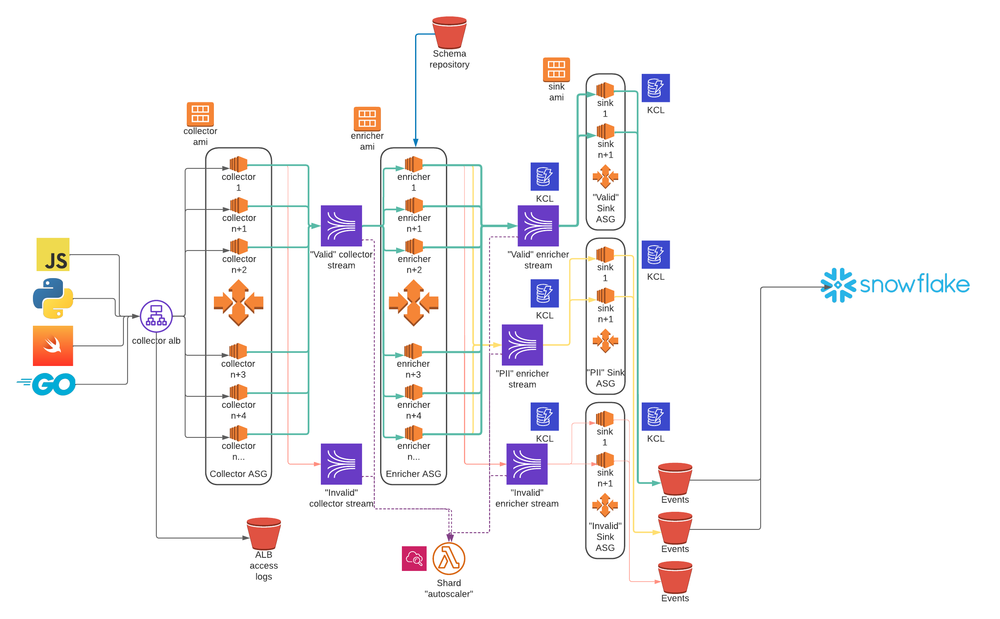

[Snowplow Analytics](https://snowplow.io/) is a highly-scalable system that powers data creation for [millions of sites](https://trends.builtwith.com/analytics/Snowplow) on the internet. Snowplow is baked into [dbt](https://github.com/dbt-labs/dbt-core/blob/main/core/dbt/tracking.py#L33-L47), powers product analytics for [dbt cloud](https://cloud.getdbt.com/), tracks activity on Snowflake's [docs](https://docs.snowflake.com/en/user-guide-getting-started.html), and is heavily used by companies like [Trello](https://trello.com/), [Gitlab](https://gitlab.com/), [Citi bank](https://www.citi.com/), [Backcountry.com](https://www.backcountry.com/), and many many more.

But after setting up, advancing, and maintaining Snowplow stacks of [various scale](https://bostata.com/268-billion-events-with-snowplow-snowflake-at-cargurus) and [scope](https://bostata.com/client-side-instrumentation-for-under-one-dollar) for half a decade I've found myself simultaneously wanting **less** and **more**.

I've wanted **fewer streams**, **fewer machines/ containers to manage**, **fewer moving pieces that introduce the potential of event duplication**, **less configuration**, and **less in-house documentation to keep things running**.

I've also wanted **more deployment flexibility**, **more options for storing schemas**, **more cost efficiencies**, **more mechanisms for seamlessly migrating between Kinesis <-> Kafka <-> Pub/Sub**, **more inputs**, **more outputs**, and **more utility from the data in transit** without duplicating it.

Which is how the idea of [buz.dev](https://buz.dev) was born.

## Inspirations and iterations

My first venture into the idea of serverless event collection was summer 2018. I was living on a boat at the time and critical boat systems are 100% intentional- they use what they need and rarely more. Bilge pumps and comms are redundant, weight distribution is carefully balanced, and power utilization is either minimized or measured carefully. Observing (and surviving thanks to) carefully-balanced constraints really got me thinking about similar implications when building data processing systems.

To test the "serverless Snowplow" idea I stitched a Cloudfront distribution, a Lambda function, S3, and the Snowplow javascript tracker together. A series of Athena external tables sat on top raw data in S3 and voila! Near-real-time analytics for practically free. It worked so well I wrote a [blog post](https://bostata.com/client-side-instrumentation-for-under-one-dollar/) and others were inspired to [do](https://discourse.snowplow.io/t/snowplow-serverless/1912/14) or [write about](https://www.ownyourbusinessdata.net/enrich-snowplow-data-with-aws-lambda-function/) the same. The system ran hands-off for several years. I didn't have to think about it a single time thanks to **minimal moving pieces** and **AWS having the responsibility of keeping it up and running**. 

The first time I saw serverless event collection work really well in production was at [CarGurus](https://www.cargurus.com/). While we had a Snowplow Analytics implementation that collected anywhere between ~5k and ~15k requests per second, a colleage had an interesting use case and wanted to see what Lambda could handle. The marketing team was firing out enormous amounts of email using [Iterable](https://iterable.com/) and an in-house implementation using [Dyn](https://help.dyn.com/email-delivery-gsg/). Each time email blasts would go out our systems would get absolutely swamped with tracking callbacks. We obviously wanted the data for analytics or tracking opt-outs but didn't want to provision static infrastructure to have it sit normally-unused. Lambda was a perfect fit and I watched over and over as the system seamlessly ramped from 0 to ~20k rps, only to return to 0 again. It was extremely low-maintenance and genius. And the bill was laughably small.

A recent time I've experienced serverless event collection work superbly was at [6 River Systems](https://6river.com/data-driven-robotics-leveraging-google-cloud-platform-and-big-data-to-improve-robot-behaviors/) (now part of Shopify Logistics) when processing mission-critical data from robots all over the world. Like at CarGurus, data volumes from fulfillment systems are highly variable. One warehouse or distribution center will have an entirely different traffic pattern than another, and volume at most spikes [through the roof during Peak months](https://supplychaingamechanger.com/strategies-to-survive-the-peak-season-fulfillment-surge/). The cost of static infrastructure within an industry where margins are already tight is a non-starter. Serverless is a perfect fit.

## Engineering challenges

While incredibly scalable and robust, setting up and maintaining OSS Snowplow is not for the faint of heart. There's a _lot_ of moving pieces, and significant considerations to be made whenever things need to change. A simplified Snowplow architecture diagram looks something like the following (excluding monitoring, alerting, log centralization, and other devops-y necessities):

These moving pieces introduce a great degree of risk so the initial hope was to get to something like:

So I jotted down initial requirements for Serverless Thing™.

### Entirely self-contained and capable of running horizontally with no issues

It feels like there's a movement of "small, mighty, and self-contained" afoot within data processing systems, and I suspect it's because *complexity is hard to keep running*.

Systems like [Redpanda](https://redpanda.com/), which effectively crams Kafka into a small self-contained binary, or [Benthos](https://www.benthos.dev/),which crams incredibly cool stream-processing functionality into a small self-contained binary, are highly inspirational. I aimed to do the same with Serverless Thing™.

### No JVM, no Spark, and no Beam.

Snowplow's [collector](https://docs.snowplow.io/docs/pipeline-components-and-applications/stream-collector/), [enricher](https://docs.snowplow.io/docs/pipeline-components-and-applications/enrichment-components/enrich/#enrich-kinesis), [s3 sink](https://docs.snowplow.io/docs/pipeline-components-and-applications/loaders-storage-targets/s3-loader/), etc all run on the JVM.

Snowplow's [RDB](https://docs.snowplow.io/docs/pipeline-components-and-applications/loaders-storage-targets/snowplow-rdb-loader-3-0-0/) and [Snowflake](https://docs.snowplow.io/docs/pipeline-components-and-applications/loaders-storage-targets/snowplow-snowflake-loader/) loaders run on Spark, while the [BigQuery](https://docs.snowplow.io/docs/pipeline-components-and-applications/loaders-storage-targets/bigquery-loader/) loader runs on Beam (Cloud Dataflow).

My experience has been Snowflake's [Snowpipe](https://docs.snowflake.com/en/user-guide/data-load-snowpipe-intro.html) functionality works pretty well, as do BigQuery [streaming inserts](https://cloud.google.com/bigquery/docs/samples/bigquery-table-insert-rows) or [BigQuery Pub/Sub subscriptions](https://cloud.google.com/pubsub/docs/bigquery). And the responsibility of keeping Snowpipe or BQ streaming inserts running is not mine :).

I decided to use Go so x-os, x-arch binaries could be built.

### Fast to start up and shut down

Making containers fast to launch makes a big impact on cost as invocations ramp, and I'm cheap, so Serverless Thing™ had to be snappy. The faster infrastructure can follow the utilization curve, the more cost-effective it is. Like the founder of DuckDB says - [burning fewer polar bears](https://youtu.be/Z-6SnP6yzgo?t=1826) is better.

### Capable of validating and bifurcating incoming payloads

A huge Snowplow feature lies within the Enricher portion of the pipeline, where each and every event is validated according to an associated jsonschema.

### Maintain an onboard schema cache that can be manually purged

### Have consistent payload structure

### Easy to configure
