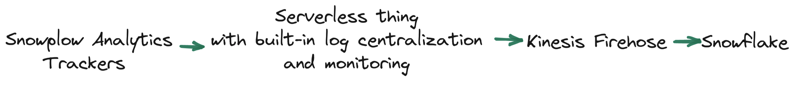

[Snowplow Analytics](https://snowplow.io/) is a highly-scalable system that powers data creation for [millions of sites](https://trends.builtwith.com/analytics/Snowplow) on the internet. Snowplow is baked directly into [dbt](https://github.com/dbt-labs/dbt-core/blob/main/core/dbt/tracking.py#L33-L47), [dbt cloud](https://cloud.getdbt.com/), Snowflake's [docs](https://docs.snowflake.com/en/user-guide-getting-started.html), [Trello](https://trello.com/), [Gitlab](https://gitlab.com/), [Citi bank](https://www.citi.com/), [Backcountry.com](https://www.backcountry.com/), etc.

After setting up, advancing, and maintaining Snowplow stacks of [various scale](https://bostata.com/268-billion-events-with-snowplow-snowflake-at-cargurus) and [scope](https://bostata.com/client-side-instrumentation-for-under-one-dollar) for half a decade I've found myself simultaneously wanting **less** and **more**.

I've often wished for **fewer streams**, **fewer machines/ containers to manage**, **fewer moving pieces that introduce the potential of event duplication**, **less configuration**, and **less in-house documentation to keep things running**.

I've also hoped for **more deployment flexibility**, **more options for storing schemas**, **more cost efficiencies**, **more mechanisms for seamlessly migrating between Kinesis <-> Kafka <-> Pub/Sub**, **more inputs**, **more outputs**, and **more utility from the data in transit** without duplicating it.

Which is how [buz.dev](https://buz.dev) was born.

<!-- truncate -->

## Inspirations and iterations

My first venture into the idea of serverless event collection was summer 2018. I was living on a boat at the time and critical boat systems are 100% intentional- they use what they need and rarely more. Bilge pumps and comms are efficient yet redundant, weight distribution is carefully balanced, and power utilization is either minimized or measured carefully. Observing (and surviving thanks to) carefully-balanced constraints really got me thinking about similar implications when building data processing systems.

To test the "serverless Snowplow" idea I stitched a Cloudfront distribution, a Lambda function, S3, and the Snowplow javascript tracker together. A series of Athena external tables sat on top raw data in S3 and voila! Near-real-time analytics for practically free. It worked so well I wrote a [blog post](https://bostata.com/client-side-instrumentation-for-under-one-dollar/) and others were inspired to [do](https://discourse.snowplow.io/t/snowplow-serverless/1912/14) or [write about](https://www.ownyourbusinessdata.net/enrich-snowplow-data-with-aws-lambda-function/) the same. The system ran hands-off for several years. I didn't have to think about it a single time thanks to **minimal moving pieces** and **AWS having the responsibility of keeping it up and running**. 

I saw entirely-serverless event collection work for the first time at [CarGurus](https://www.cargurus.com/). While we had a Snowplow Analytics implementation that collected anywhere between ~5k and ~15k requests per second, a colleage had an interesting use case and wanted to see what Lambda could handle. The marketing team was firing out enormous amounts of email using [Iterable](https://iterable.com/) and an in-house implementation using [Dyn](https://help.dyn.com/email-delivery-gsg/). Each time email campaigns were sent our systems would get absolutely swamped with tracking callbacks. We wanted the data for analytics or tracking opt-outs, but didn't want to provision static infrastructure to have it sit normally-unused. Lambda was a perfect fit and I watched as the system continuously ramped from 0 to ~20k rps, only to return to 0 again. It was extremely low-maintenance and genius. And the bill was laughably small.

After I set up Snowplow for a [NYC-based commercial real estate company](https://www.bisnow.com/), the VP of Technology (who is now @ Disney Streaming) pushed it further with a simple Lambda. Instead of being limited to Snowplow tracker protocol payloads, the Lambda function collected arbitrary payloads, reformatted them to be consistent with Snowplow [Self-Describing Events](https://docs.snowplow.io/docs/understanding-tracking-design/out-of-the-box-vs-custom-events-and-entities/#self-describing-events), and fired them into the Snowplow collector. It was efficient, thought-provoking, and genius.

I've experienced the benefits of serverless event collection more recently at [6 River Systems](https://6river.com/data-driven-robotics-leveraging-google-cloud-platform-and-big-data-to-improve-robot-behaviors/) (now part of Shopify Logistics) when processing mission-critical data from robots all over the world. Like at CarGurus, data volumes from fulfillment systems are highly variable. One warehouse or distribution center will have a very different traffic pattern than another, and volume at most spikes [through the roof during Peak months](https://supplychaingamechanger.com/strategies-to-survive-the-peak-season-fulfillment-surge/). Inefficiencies inherent with over-provisioned static infrastructure, in an industry where margins are already tight, is a non-starter.

**Serverless is a perfect fit for event tracking and I've become convinced it is the way.**

# Engineering challenges

While incredibly scalable and robust, setting up and maintaining OSS Snowplow is not for the faint of heart. There's a _lot_ of moving pieces, and significant considerations must be made whenever the system needs to change. A simplified Snowplow architecture diagram looks something like the following (excluding monitoring, alerting, log centralization, and other devops-y necessities):

These moving pieces introduce a great degree of risk so the initial hope was to get to something like:

So I jotted down some initial requirements for Serverless Thing™.

### Minimal human involvement to keep running

Systems are great when you don't need to think about them. In Julia Evans' words spending [approximately 0 time on operations](https://jvns.ca/blog/2022/07/09/monitoring-small-web-services/) was the goal.

I didn't want to think about Serverless Thing™.

### Self-contained and capable of running horizontally with no issues

It feels like there's a movement of "small, mighty, and self-contained" afoot within data processing systems, and it's probably because *complexity is hard to keep running*.

Systems like [Redpanda](https://redpanda.com/), which effectively crams Kafka into a small self-contained binary, or [Benthos](https://www.benthos.dev/), which crams cool stream-processing functionality into a small self-contained binary, are highly inspirational. I aimed to do the same with Serverless Thing™.

### No JVM, no Spark, no Beam

Snowplow's [collector](https://docs.snowplow.io/docs/pipeline-components-and-applications/stream-collector/), [enricher](https://docs.snowplow.io/docs/pipeline-components-and-applications/enrichment-components/enrich/#enrich-kinesis), [s3 sink](https://docs.snowplow.io/docs/pipeline-components-and-applications/loaders-storage-targets/s3-loader/), etc all run on the JVM.

Snowplow's [RDB](https://docs.snowplow.io/docs/pipeline-components-and-applications/loaders-storage-targets/snowplow-rdb-loader-3-0-0/) and [Snowflake](https://docs.snowplow.io/docs/pipeline-components-and-applications/loaders-storage-targets/snowplow-snowflake-loader/) loaders run on Spark while the [BigQuery](https://docs.snowplow.io/docs/pipeline-components-and-applications/loaders-storage-targets/bigquery-loader/) loader runs on Beam (Cloud Dataflow).

My experience has been Snowflake's [Snowpipe](https://docs.snowflake.com/en/user-guide/data-load-snowpipe-intro.html) functionality works pretty well, as do BigQuery [streaming inserts](https://cloud.google.com/bigquery/docs/samples/bigquery-table-insert-rows) or [BigQuery Pub/Sub subscriptions](https://cloud.google.com/pubsub/docs/bigquery). And the responsibility of keeping Snowpipe or BQ streaming inserts running is not mine :).

Serverless Thing™ uses Go so x-os, x-arch binaries can be shipped.

### Fast startup and shutdown

Making containers fast to launch makes a big impact on cost as invocations ramp, and I'm cheap, so Serverless Thing™ had to be snappy. The faster infrastructure can follow the utilization curve, the more cost-effective it is.

Computers also generate a ton of heat, and *[burning fewer polar bears](https://youtu.be/Z-6SnP6yzgo?t=1826) is always better.*

### Payload validation, annotation, and bifurcation

A very valuable Snowplow feature lies within the `Enricher` portion of the pipeline, where each and every event is validated according to an associated jsonschema.

The only way to do this quickly is via an onboard schema cache, so it became a secondary requirement.

### Just JSON

Snowplow data is serialized using **[thrift](https://thrift.apache.org/)** between the collector and the enricher but becomes **tsv** downstream of the enricher. This makes it hard to point a system like [Materialize](https://materialize.com/) at the "enriched" stream without first `reading tsv records` -> `formatting as json` -> `writing to a separate stream`. Write amplification quickly becomes reality and the operator must make a choice between **not reading from the stream** or **re-formatting every payload to something that is easily pluggable with other stream processing systems**. At higher volumes this is $$$.

While JSON is not the smallest data format it is still more efficient to write JSON once than having many copies of smaller formats. I chose to have **fewer** copies but a **larger per-record data format**.

### Easy to configure

YML + Jsonschema validation is [pretty standard](https://www.schemastore.org/json/) so I went with that instead of HOCON. It turned out to be a pretty good decision since auto-completing, auto-validating config is handy.

### Make event streaming accessible

[dbt](https://www.getdbt.com/) has been so inspirational because it makes good data engineering practices accessible to all. Data engineering tricks have become dbt packages that anyone can import.

Like the data engineering of not-that-long-ago, streaming systems are **intimidating**. But they don't need to be. Streaming systems are also often **overkill**. Throwing data into several streams only to load it into a Postgres database means the streaming infrastructure is probably unnecessary.

Ideally Serverless Thing™ could make streaming accessible while empowering orgs to evolve from the current stack to a desired future state. Event if that means firing events to [Postgres](https://buz.dev/integrations/postgres) now and [Kafka](https://buz.dev/integrations/kafka) later.

# Progress thus far

Though early, I'd like to think the journey of serverlessly collecting Snowplow Analytics events has been worthwhile. It has come a long way but has further to go.

### Expanding to more inputs

Early on in the exploration I had a eureka moment - if this works for the [Snowplow tracker protocol](https://docs.snowplow.io/docs/collecting-data/collecting-from-own-applications/snowplow-tracker-protocol/) it should also work for others. Turns out, it does. Easily. And also minimizes the hassle of running multiple event tracking pipelines - one for each protocol.

Cloudevents with its (optional) [dataschema](https://cloudevents.github.io/sdk-javascript/interfaces/event_interfaces.CloudEventV1.html#dataschema) property was a low-effort addition. Fire payloads using the Cloudevents' `data` property, provide a schema reference in `dataschema`, and voila! Validated events and the sdk's [are even already written.](https://github.com/cloudevents?q=sdk-&type=all&language=&sort=)

Data collection using pixels and webhooks was a fun addition, mostly because both of these sources are often painful due to the arbitrary nature of their payloads. But another thought came to mind - validate these too! Since it would be fab to namespace and validate these payloads, named [pixels](http://localhost:3000/inputs/buz/pixel#named-pixels) and [webhooks](http://localhost:3000/inputs/buz/webhook#named-webhooks) came to be.

### Writing events to a variety of destinations

### Writing events to multiple destinations

### Using the destination system as a schema registry

In the spirit of minimizing moving pieces, and because it's fun, 