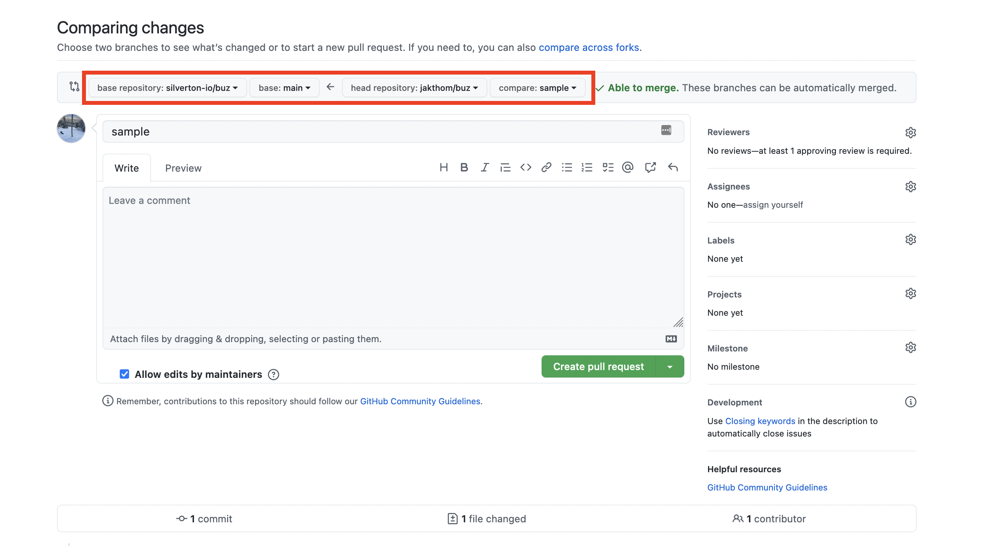

The following is a high-level overview of the steps involved when contributing code to Buz.


## Developing via fork


### Prerequisites

Buz is a project written in Go 1.19. You will need it to develop and that's really it.

:::danger Required for development
- [go 1.19](https://go.dev/blog/go1.19)
:::


:::info Niceties
- [docker](https://docs.docker.com/get-docker/)
- [docker compose](https://docs.docker.com/compose/)
:::


### Fork Buz


### Clone your fork

    git clone git@github.com:YOU/buz.git


### Bootstrap


**After `cd`ing into the `buz` directory you just cloned, run:**

    make bootstrap

**You should now have a local `config.yml` file and see console output like the following:**

```
...
...
{"level":"info","time":"2022-09-24T21:52:35-04:00","message":"🟢 initializing custom snowplow routes"}
{"level":"info","time":"2022-09-24T21:52:35-04:00","message":"🟢 initializing custom open redirect route"}
{"level":"info","time":"2022-09-24T21:52:35-04:00","message":"🟢 initializing generic routes"}
{"level":"info","time":"2022-09-24T21:52:35-04:00","message":"🟢 initializing cloudevents routes"}
{"level":"info","time":"2022-09-24T21:52:35-04:00","message":"🟢 initializing webhook routes"}
{"level":"info","time":"2022-09-24T21:52:35-04:00","message":"🟢 initializing pixel routes"}
{"level":"info","time":"2022-09-24T21:52:35-04:00","message":"🟢 initializing squawkbox routes"}
{"level":"info","time":"2022-09-24T21:52:35-04:00","message":"🐝🐝🐝 buz is running 🐝🐝🐝"}
```

### Running Tests

**To run `go test` and open up a browser-based coverage report run:**

    make test-cover-pkg


### Cut a PR from your fork back into buz `main` branch




### Profit

If you don't see movement on your newly-created PR please ping one of the maintainers (nicely 😉).


## Other

### General Help

**To view all `make` options run:**

    make help

**You should see something like the following:**

```
$ make help

Usage:
  make
  run              Run buz locally
  bootstrap        Bootstrap development environment
  bootstrap-destinations  Bootstrap various containerized database/stream systems
  build-docker     Build local buz image
  buildx-deploy    Build multi-platform buz image and push it to edge repo
  lint             Lint go code
  test             Run tests against pkg
  test-cover-pkg   Run tests against pkg, output test profile, and open profile in browser
  help             Display makefile help
```

## Where to go next

- Pick up an issue from [github](https://github.com/silverton-io/buz/issues) and cut your first PR.
- [Deploy Buz](/deploying/gcp/terraform) to a production environment.
- Play around with the [Buz documentation](/developing/documentation-site).
- Read about the [general philosophy](/introduction/philosophy) of Buz.
