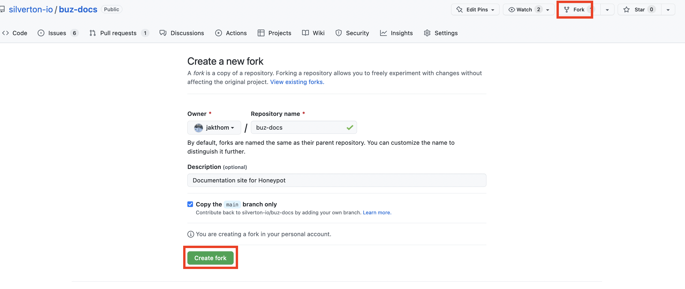
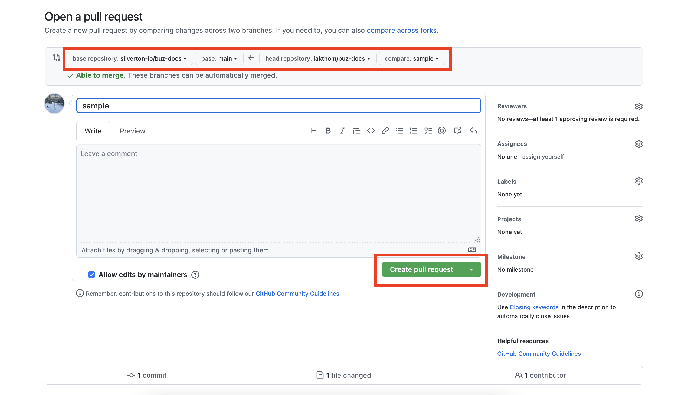

The following is a high-level overview of the steps involved when contributing documentation to Buz.

## Developing via fork

### Prerequisites

The Buz documentation site is built with [Docusaurus](https://docusaurus.io/) so you'll need [yarn](https://yarnpkg.com/) and [node](https://nodejs.org/en/) and that's pretty much it.

:::danger Prerequisites
You will need these:

- [yarn](https://yarnpkg.com/)
- [nodejs](https://nodejs.org/en/)
:::

### Fork the documentation

### Clone your fork

    git clone git@github.com:silverton-io/buz-docs.git

### Bootstrap

**After `cd`ing into the `buz-docs` directory you just cloned, run:**

    yarn

### Run docs site locally

**To build (and auto-reload) the docs site:**

    yarn start

### Cut PR from your fork back into buz-docs `main` branch

### Profit

If you don't see movement on your newly-created PR please ping one of the maintainers (nicely 😉).

## Other

### Deploying Buz documentation

The docs site is auto-deployed using [Github Actions](https://github.com/silverton-io/buz-docs/blob/main/.github/workflows/deploy-docs.yml). It will be automatically built and deployed after changes are merged to `main`.

## Where to go next

- Pick up an issue from [github](https://github.com/silverton-io/buz/issues) and cut your first PR.
- [Deploy Buz](/deploying/gcp/cloud_run) to a production environment.
- Play around with the [Buz documentation](/contributing/contributing-documentation-to-buz).
- Read about the [general philosophy](/introduction/philosophy) of Buz.
