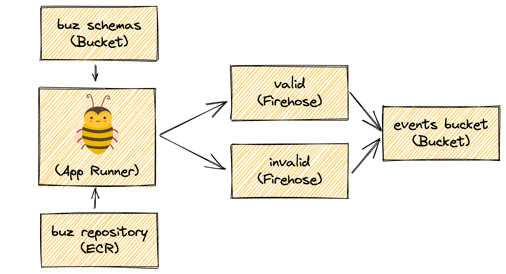

## Overview
[AWS App Runner](https://aws.amazon.com/apprunner/) is an easy way to deploy containerized web applications. Here we are deploying the Buz image (along with the config.yml) to ECR so it can be used by App Runner. The schemas are maintained in S3. Data processed by buz are sent to one of two Kinesis Firehoses depending on if the event is valid or invalid. Finally all events are persisted in another S3 bucket. Within this bucket events are categorized in different prefixes.

## Primary Resources
* Buz (App Runner)
* ECR Repo
* 2 S3 Buckets
* 2 Kinesis Firehoses

## Terraform
[Github Terraform](https://github.com/silverton-io/buz/tree/main/deploy/terraform/aws/app_runner)