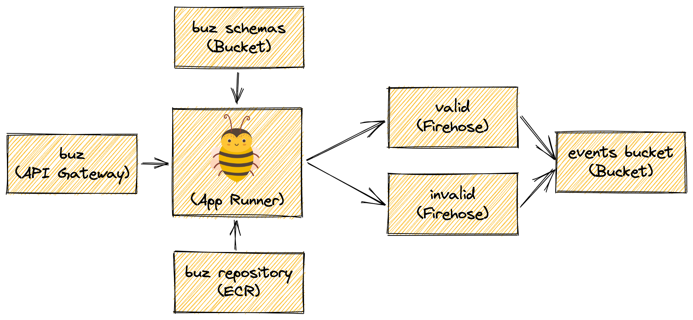

## Overview
[AWS Lambda](https://aws.amazon.com/lambda/) is one of the primary ways to maintain serverless code in the cloud. Here we are deploying the Buz image (along with the config.yml) to ECR and running the image within a Lambda associated with an API Gateway. The schemas are maintained in S3. Data processed by buz are sent to one of two Kinesis Firehoses depending on if the event is valid or invalid. Finally all events are persisted in another S3 bucket. Within this bucket events are categorized in different prefixes.

## Primary Resources
* Buz (Lambda)
* ECR Repo
* API Gateway
* 2 S3 Buckets
* 2 Kinesis Firehoses

## Terraform
[Github Terraform](https://github.com/silverton-io/buz/tree/main/deploy/terraform/aws/lambda)