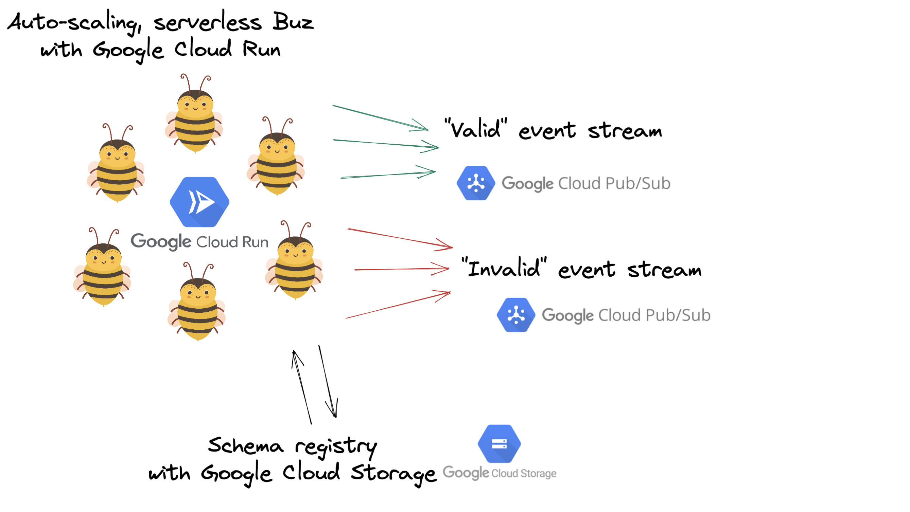

# Deploy Buz to Cloud Run using Terraform

**Estimated time: 3 minutes**



## Overview

The (absolute) easiest way to deploy Buz on GCP is via **[Google Cloud Run](https://cloud.google.com/run)** and Terraform.

The terraform deployment consists of the following GCP resources:

* **1 Cloud Run service for running serverless Buz**
* **1 Secret Manager secret for Buz configuration**
* **1 Domain mapping for running Buz behind a pretty name**
* **1 GCS bucket for schemas**
* **2 Pub/Sub topics for valid and invalid events**
* **1 Artifact Registry Repository for hosting Buz artifacts**
* **1 BigQuery dataset**
* **2 BigQuery tables for valid/invalid events**
* **2 Pub/Sub -> BigQuery subscriptions for pushing data to BigQuery automatically**

It also provisions the appropriate IAM configuration, enables GCP services if they have not already been enabled, etc.


:::warning Local Prerequisites
You will need the following locally to terraform Buz:
- [Terraform](https://www.terraform.io/downloads)
- [gcloud](https://cloud.google.com/sdk/gcloud) cli
- [docker](https://www.docker.com/)
:::


## Deploy

## 1. Clone the Buz repo and navigate to GCP deployment dir

```
git clone git@github.com:silverton-io/buz.git && cd buz/deploy/terraform/gcp/
```

## 2. Auth gcloud

```
gcloud auth application-default login
```

## 3. Create and Populate tfvars file


```
touch terraform.tfvars
```

**Sample Contents:**

```
gcp_project = "YOUR_PROJECT"
system = "buz"
env = "prd"
buz_domain = "buz.YOUR_DOMAIN.com"
buz_version = "v0.11.11"
schema_bucket_name = "schemas"
bigquery_dataset_name = "buz"
```


## 4. Apply
```
terraform apply
```

**If all is well the terraform output will be something like the following:**

```
Outputs:

buz_domain = "buz.YOURDOMAIN.com"
buz_service_id = "locations/us-central1/namespaces/YOUR_PROJECT/services/buz"
buz_service_status = tolist([
  {
    "conditions" = tolist([
      {
        "message" = ""
        "reason" = ""
        "status" = "True"
        "type" = "Ready"
      },
      {
        "message" = ""
        "reason" = ""
        "status" = "True"
        "type" = "ConfigurationsReady"
      },
      {
        "message" = ""
        "reason" = ""
        "status" = "True"
        "type" = "RoutesReady"
      },
    ])
    "latest_created_revision_name" = "buz-lnhtr"
    "latest_ready_revision_name" = "buz-lnhtr"
    "observed_generation" = 1
    "url" = "https://buz-n3oujm40err-uc.a.run.app"
  },
])
buz_version = "v0.11.11"
gcp_project = "YOUR_PROJECT"
gcp_region = "us-central1"
invalid_topic = "buz-prd-invalid-events"
schema_bucket = "buz-prd-schemas"
valid_topic = "buz-prd-valid-events"
```
