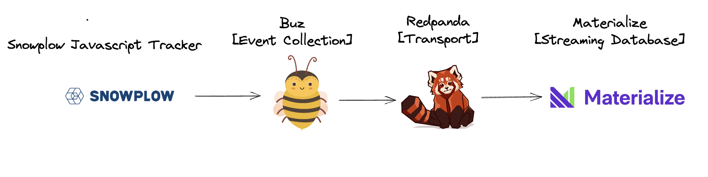
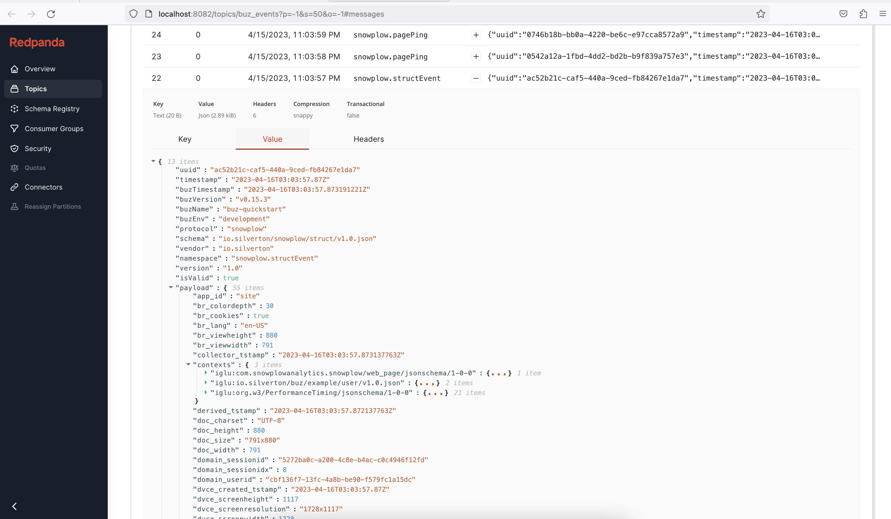

# Quickstart

This quickstart will get you started with Buz, a multi-node Redpanda cluster, and the Redpanda console for rapidly bootstrapping a lightweight streaming stack.





**If you don't have `docker` and `docker-compose` you will need to install those first.**


## 1. Clone the Buz repo

**`git clone git@github.com:silverton-io/buz.git && cd buz`**


```
~/code ❯❯❯ git clone git@github.com:silverton-io/buz.git
Cloning into 'buz'...
remote: Enumerating objects: 1324, done.
remote: Counting objects: 100% (1324/1324), done.
remote: Compressing objects: 100% (615/615), done.
remote: Total 1324 (delta 611), reused 1163 (delta 495), pack-reused 0
Receiving objects: 100% (1324/1324), 25.89 MiB | 4.35 MiB/s, done.
Resolving deltas: 100% (611/611), done.
~/code ❯❯❯ cd buz
```

## 2. Bootstrap Buz, Redpanda, and the Redpanda Console

**`docker-compose -f examples/quickstart/docker-compose.yml up -d`**

:::danger Note
This step requires [docker-compose](https://docs.docker.com/compose/).
:::


```
~/c/buz ❯❯❯ docker-compose -f examples/quickstart/docker-compose.yml up -d
...
[+] Running 7/7
 ⠿ Container redpanda-3            Healthy                                                                                                                                                                                                      1.6s
 ⠿ Container buz-quickstart-ui     Started                                                                                                                                                                                                      0.3s
 ⠿ Container redpanda-1            Healthy                                                                                                                                                                                                      2.1s
 ⠿ Container redpanda-2            Healthy                                                                                                                                                                                                      1.6s
 ⠿ Container console               Started                                                                                                                                                                                                      2.3s
 ⠿ Container buz                   Healthy                                                                                                                                                                                                      3.9s
 ⠿ Container buz-quickstart-proxy  Started
```


## 3. Send Events to Buz

The Buz quickstart serves an instrumented page to quickly start firing [Snowplow Browser Tracker events](https://docs.snowplowanalytics.com/docs/collecting-data/collecting-from-own-applications/javascript-trackers/javascript-tracker/javascript-tracker-v3/) located here: [localhost:8081](http://localhost:8081/)

**The following events are tracked (using both the `GET` and batch `POST` capabilities of the Snowplow tracker):**

  - Page views
  - Page pings (time on page)
  - Transaction events and transaction item events
  - Struct events
  - Snowplow self-describing events


## 4. View Events in the Redpanda Console

The Buz Quickstart runs a Redpanda Console at [localhost:8082](http://localhost:8082).

Incoming events can be viewed in the console using the [Topic Viewer](http://localhost:8082/topics/buz_events?p=-1&s=50&o=-1#messages):




# Next Steps

We are having fun building Buz. Want to know more?

- Sign up for **[Insiders-Only Updates](/insiders-only)**
- Come chat on **[Discord](https://discord.gg/JFKVnVdF2m)**
- Check out the **[Roadmap](/introduction/roadmap)**
