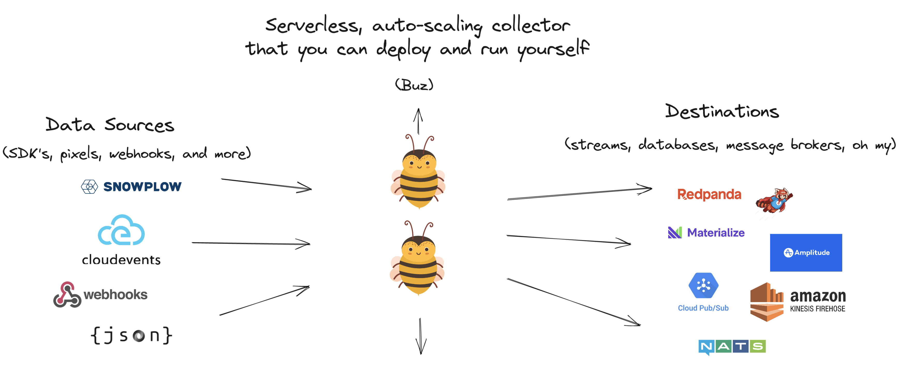

# Send pixel data to Kafka using Buz for $0.

## Buz makes it easy to collect pixel data and send it to Kafka using your **own infrastructure**.

# Why Buz?

- It's Free and entirely [Open-Source](https://github.com/silverton-io/buz).
- No SaaS, DPA, MDS products, or dealing with legal necessary. ***Buz runs on your infrastructure***.
- Buz is a **lightweight** and **cost-efficient** way of collecting data.
- Buz **empowers teams to run their own data collection systems**.
- Buz is **quick to set up** and **easy to maintain long term** thanks to **minimal moving pieces**.
- Buz is serverless-native, and **automatically scales as data volumes do (including to `0`)**.

# Quickstart a local Buz stack

Want to get started quickly? The [Buz Quickstart](/examples/quickstart) bootstraps an end-to-end streaming analytics stack using Buz, [Redpanda](https://redpanda.com/?utm_medium=hipanda&utm_source=buz), the [Redpanda Console](https://docs.redpanda.com/docs/console/?utm_medium=hipanda&utm_source=buz), and [Materialize](https://materialize.com/?utm_medium=himaterialize&utm_source=buz).

# Deploy Buz on Google Cloud in under 5 minutes

The production-ready GCP stack includes Buz, Google Pub/Sub, Pub/Sub subscriptions, and BigQuery. It can be set up in minutes:

- [Using Terraform](/production-deployment/gcp/terraform)
- [Using the Google Cloud Console](/production-deployment/gcp/console)

